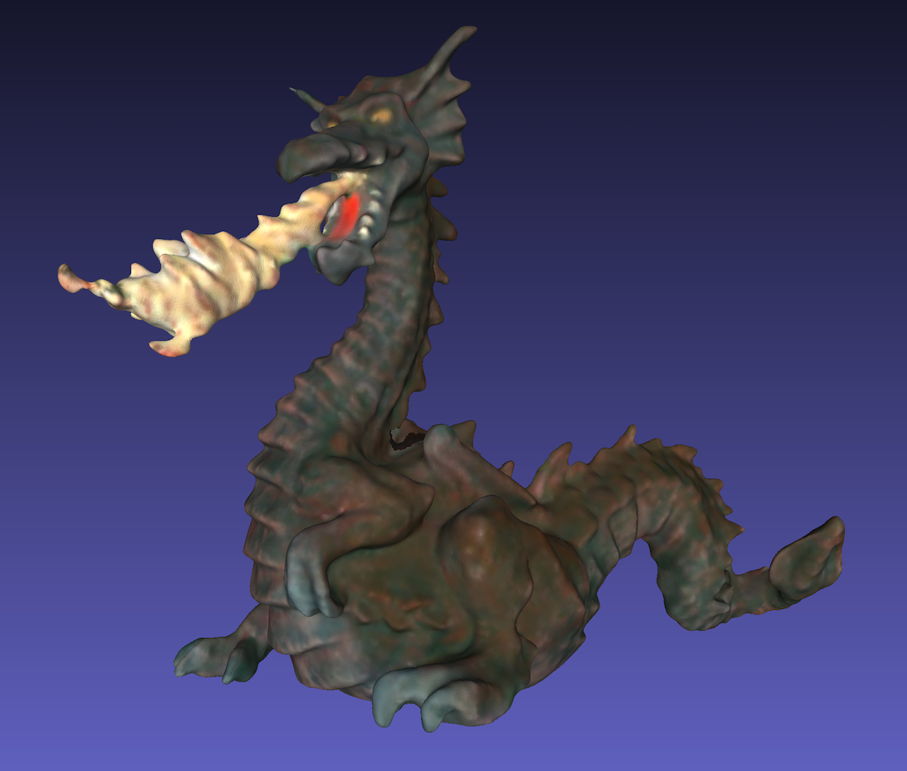
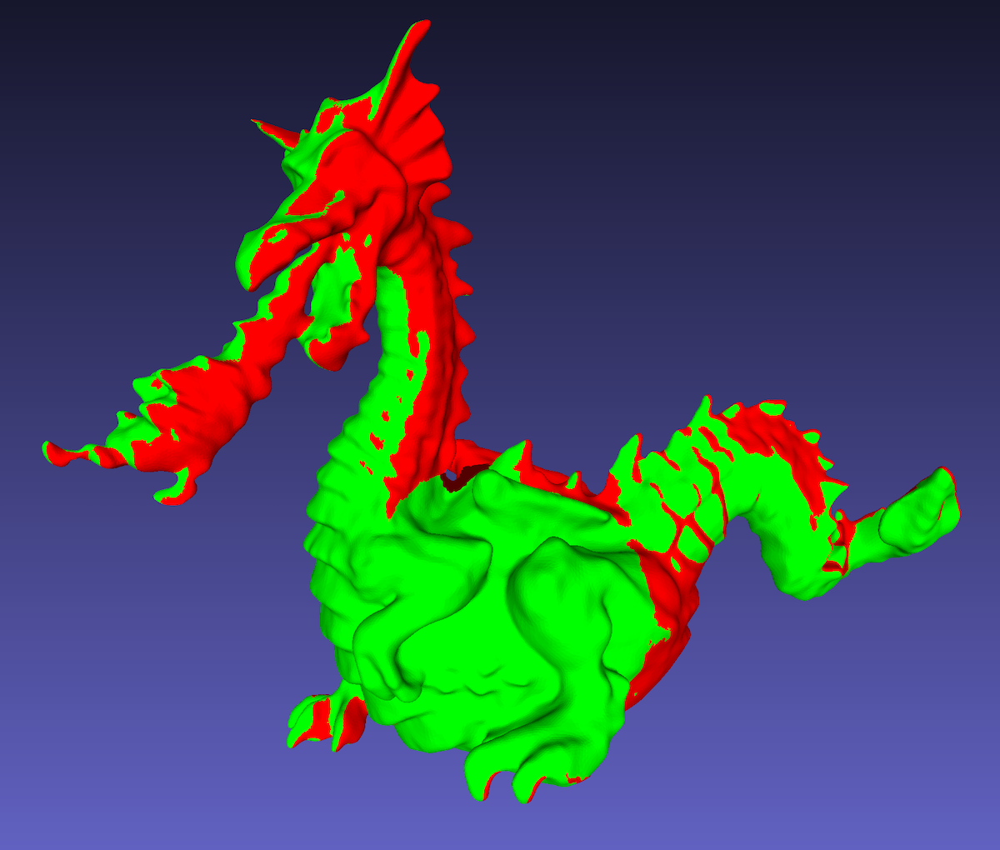
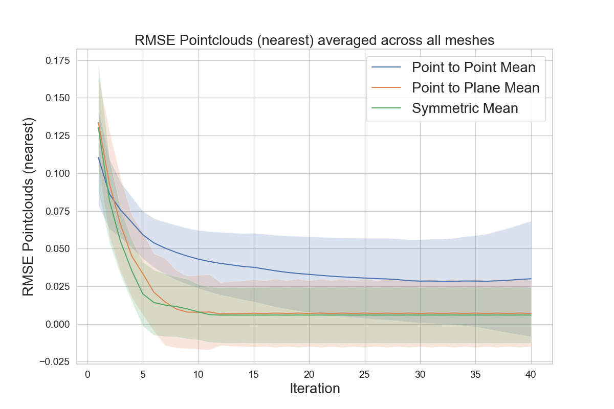
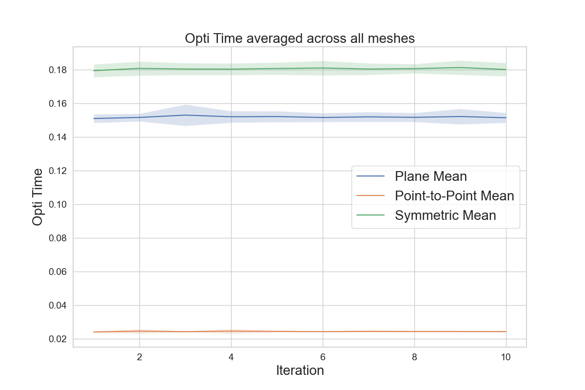

# Analysis of Iterative Closest Point Algorithms


<p align="middle">
  
   
</p>
<p align="middle">Two non-overlapping dragon meshes aligned by ICP.</p>

## Introduction
This is the project for the course 3D Scanning & Motion Capture at Technical University of Munich.
The goal of this project is to compare different variants of ICP. 
- Correspondence methods: Normal Shooting, Nearest Neighbors and Nearest Neighbors with Color Information. 
- Objective functions: Point-to-Point, Point-to-Plane, Symmetric ICP (all three in both linearized and full forms).

## Installation

### Requirements
```bash
- flann
- freeimage
- Eigen
- Ceres
- yaml-cpp
* Open3D    # optional
* glog      # for windows
* lz4       # for macOS
```

Installing Open3D with something besides homebrew is a nightmare, so it is an optional part. \
Cmake will automatically handle this and disable visualization in case Open3D was not found.


### Building and running on macOS
Everything is available with homebrew.
```bash
brew install flann
brew install freeimage
brew install ceres-solver
brew install eigen
brew install yaml-cpp
brew install lz4
```
CMakeLists contains hints on installation paths and will notify if they need to be set explicitly.
```bash
mv CMakeLists_macos.txt CMakeLists.txt
mkdir build && cd build
cmake ..
make
```

### Building and running on Windows
glog is added to the requirements.
```bash
mv CMakeLists_win_linux.txt CMakeLists.txt
mkdir build && cd build
cmake ..
make
```

### Docker

If you want to use Docker, use the following command to create a Docker image and install and compile the required dependencies.

```bash
docker build . -t 3dsmc-icp
```

#### Start the development environment

```bash
docker-compose up
```

#### Access the environment

http://localhost:8443/
Clone this repository into the Docker image.


## Running
```bash
cd build
./icp ../configs/<path_to_config>.yaml
```

In the config you can set:
- correspondence method
- optimization objective
- whether to use color information
- other optimization settings
- data path
- output directory (experiment name)
- whether to visualize and which metrics to evaluate \
For a complete list of options plese refer to `include/ICPConfiguration.h`
```sh
# Task
runShapeICP: true
runSequenceICP: false
# ICP type
useLinearICP: true
# ICP objective(s)
useSymmetric: true
# Correspondence method (NN / SHOOT)
correspondenceMethod: NN
useColors: true
# Other settings
matchingMaxDistance: 0.1
nbOfIterations: 10
# Error metrics
evaluateRMSENearest: true
evaluateTransforms: true
evaluateTime: true                      
# Experiment
experimentName: plane_linear_nn_partial  # Experiment name for folder name
dataDir: ../../Data/greyc_partial/       # Output directory
```

Results are automatically saved into `results` directory, separated by experiment name and different meshes. \
You can combine and average metrics with tools in `/visualize`: there is a README.


<p align="middle">After visualization you will get images similar to these..</p>

<p align="middle">
  
   
</p>


## Data
The datasets was used:
- GREYC 3D Colored Mesh Database (preprocessed) \
- TUM RGB-D dataset \
 [Download the data](https://syncandshare.lrz.de/getlink/fiUgchGbMDtkDJrsPWbAu9/Data.zip) and extract to the directory near the repository (this way example configs can be used without modifications).


## Directory layout

```bash
icp
├── CMakeLists_macos.txt
├── CMakeLists_win_linux.txt
├── Dockerfile
├── README.md
├── src
│   ├── DataLoader.cpp                                  # Dataloader for GREYC meshes
│   ├── Evaluator.cpp                                   # Class that 
│   ├── ICPConfiguration.cpp                            # Class for configuration
│   ├── ICPOptimizer.cpp
│   ├── ProcrustesAligner.cpp
│   ├── Search.cpp
│   ├── Utils.cpp
│   └── main.cpp
├── configs
│   └── ...                                             # Sample configs
├── docker
│   ├── Dockerfile
│   └── docker-compose.yaml
├── external                                            # Data utils
│   └── data_utils
│       ├── Eigen.h
│       ├── FreeImageHelper.cpp
│       ├── FreeImageHelper.h
│       ├── PointCloud.h
│       ├── SimpleMesh.h
│       └── VirtualSensor.h
├── include                                             # Headers
│   ├── Constraints.h
│   ├── DataLoader.h
│   ├── Evaluator.h
│   ├── ICPConfiguration.h
│   ├── ICPOptimizer.h
│   ├── ProcrustesAligner.h
│   ├── Search.h
│   └── Utils.h
├── reproduce                                           # Everything you need to reproduce results.
│   ├── conf
│   │   ├── ...
│   │   ...
│   └── ...
├── visualize                                           # Everything you need for visualization of results.
│   ├── README.md
│   ├── plot_shape_experiments.py
│   ├── plot_visualize.py
│   └── requirements.txt
└── assets                                              # Images from this README
```